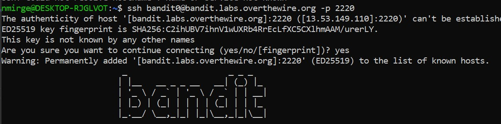

#### This file has all inforation for logging into bandit0 user and more
#### 1. level0-
##### 1) to login-$ssh bandit0@bandit.labs.overthewire.org -p 2220 
##### 2) Input password as bandit0 for bandit0 user and respectively.

#### 2. Level 1:
     Commands you may need to solve this level
     ls , cd , cat , file , du , find

