## This file has information about how to run ssh ec2-user instance on ubunto
#### There are two ways to run ec2-user instance on ubunto
Step 1- Make one file and copy labsuser ssh key and then access ec2-user
Step 2- Copy whole Downloads desktop folder and access in ubunto and then ssh ec2-user instance.

We will go in details 

### Step 1- Create labsuser.pem file and copy labsuser ssh key and Access

1. Start the lab
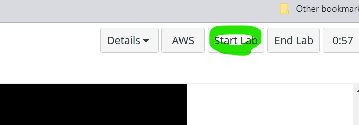
2. Click on AWS
3. Click on show

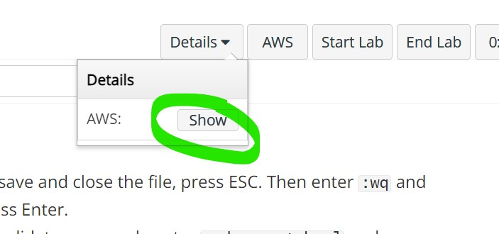

4. go to ssh key section and click on show and copy text.

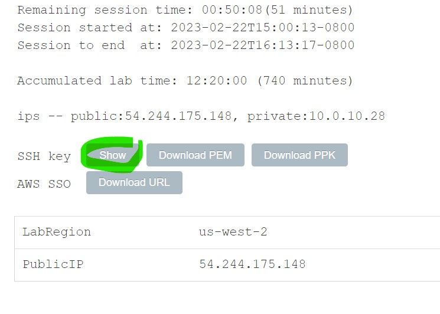

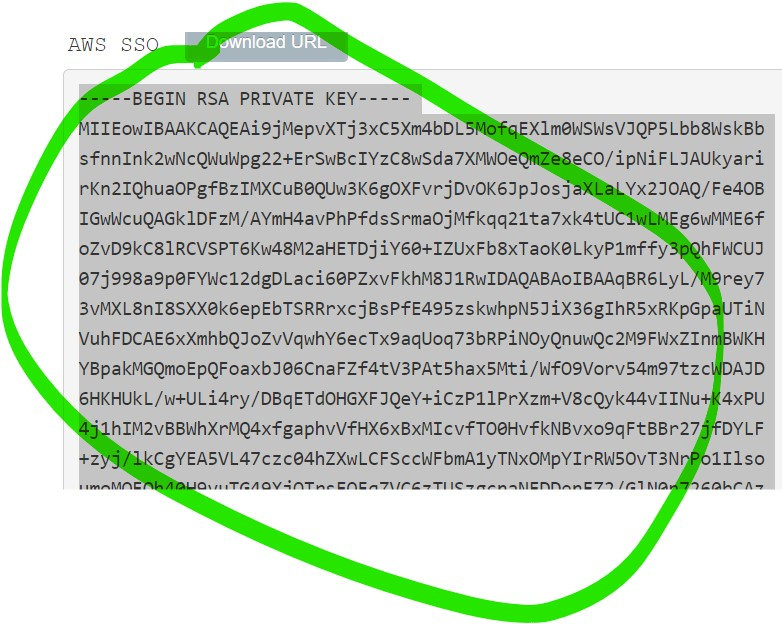

5. Go to ubunto terminal
6. Create empty labsuser.pem file and with nano copy key text and save.

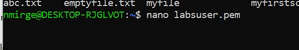

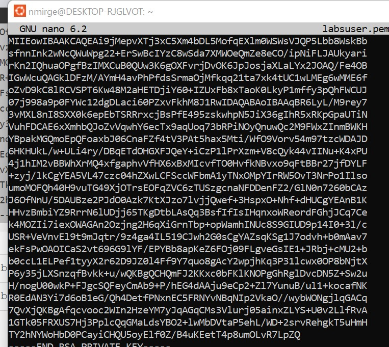

7. Now sudo ssh into ec2-user.

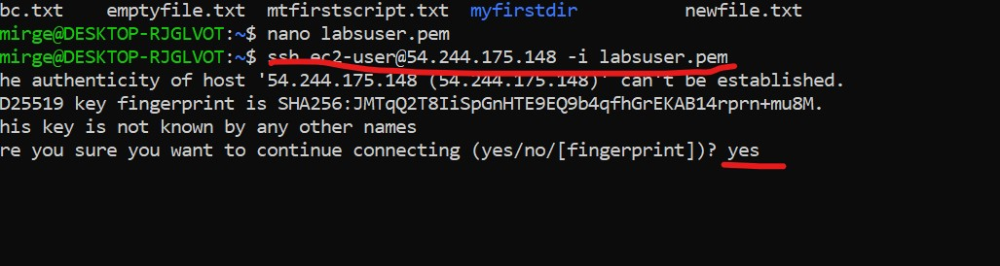

8. Enter Password

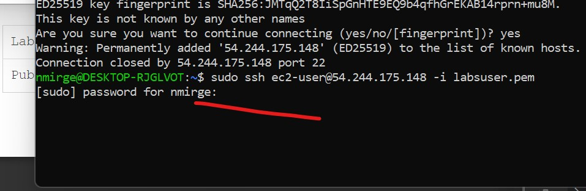

9.  Congratulations!!! you logged into ec2-user
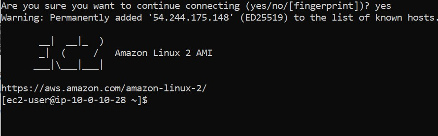

## Step 2: By coping Downloads folder to ubuntu terminal and connect ec2-user

1. From above steps follow 1 t0 3
1. Start the lab

2. Click on AWS
3. Click on show
4. Download the labsuser.pem file to Downloads desktop folder.
5. Open ubunto terminal
6. Create download folder

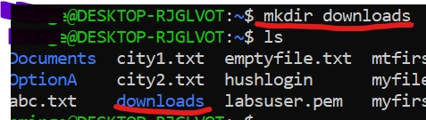

7. Run ln -s /mnt/c/Users/namita/Downloads ./downloads

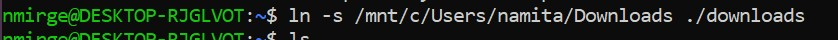

8. Now you can acess Downloads folder from desktop

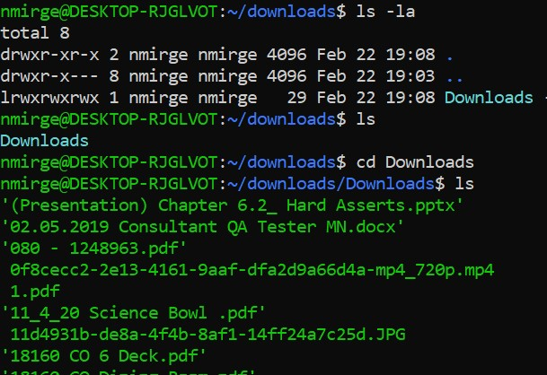

9. run sudo  ssh command to login sudo ssh ec2-user@ipaddress -i labsuser.pem

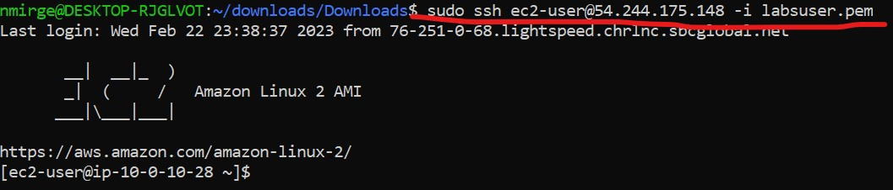

10. Congratiulations!!! you logged in as ec2-user.