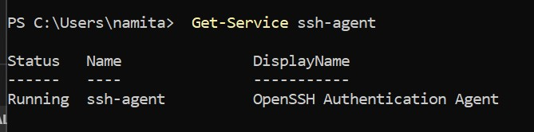
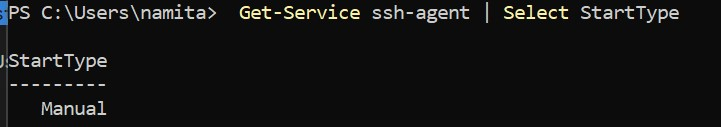
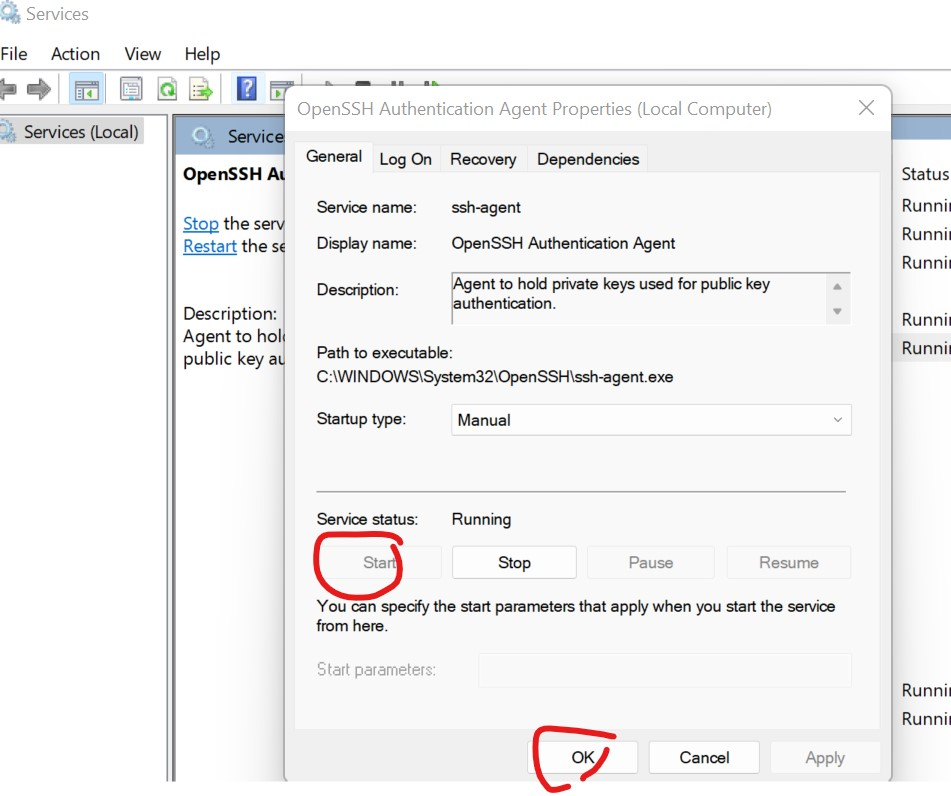

## How to make ssh-agent active or enable
There are multiple ways to make ssh- agent running.
### You can check this by running in Windows PowerShell:

1.   Get-Service ssh-agent

2.   And then check the output of status is not      running.

3.  Then check that the service has been disabled by running

     Get-Service ssh-agent | Select StartType

    StartType
    ---------
    Disabled

4. For above error seems to mean that ssh-agent is not installed (on windows) hasn't been started.
Below image shows the agent is running manually.

5. You can check whether ssh agent is running or not using below command on windows powershell

        Get-Service ssh-agent

And then check the output of status is not running.

    Status   Name               DisplayName
    ------   ----               -----------
    Stopped  ssh-agent          OpenSSH Authentication Agent

6. Then check that the service has been disabled by running following command

    Get-Service ssh-agent | Select StartType

        StartType
        ---------
        Disabled
7. You can set the service to start manually. You can do this through the Services GUI or you can run the command in admin mode:

        Get-Service -Name ssh-agent | Set-Service -StartupType Manual
     

 8. GUI mode- go to services and select open ssh service and then start service manually.
  

 9. now go to gitbash terminal and type below command and enter. you should able to see the agent is running

    eval $(ssh-agent -s)   